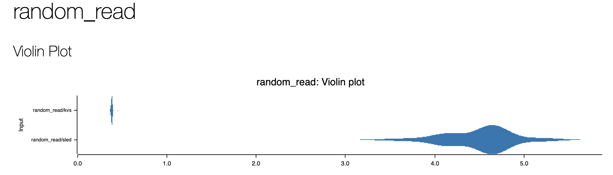

# networked_applications_rust
This is a open source project for Rust lovers and learnners as part of the PingCap talent plan project(https://github.com/pingcap/talent-plan). Over a series of projects, the Rust learners will  build a single networked, multithreaded, and asynchronous Rust application. Creating this application, a key-value database, will provide opportunities to exercise the best of the crate ecosystem, a variety of concurrent data types, the world of async Rust, interesting language features, and important Rust tools.

## Content

- [x] Create an in-memory key/value store that passes simple tests and responds to command-line arguments.
  - [x] Install the Rust compiler and tools
  - [x] Use cargo init / run / test / clippy / fmt
  - [x] Learn how to find and import crates from crates.io
  - [x] Define an appropriate data type for a key-value store

- [x] Create a persistent key/value store that can be accessed from the command line by interacting with file systems.
  - [x] Handle and report errors robustly
  - [x] Use serde for serialization
  - [x] Write data to disk as a log using standard file APIs
  - [x] Read the state of the key/value store from disk
  - [x] Map in-memory key-indexes to on-disk values
  - [x] Periodically compact the log to remove stale data
  
- [x] Create a single-threaded, persistent key/value store server and client with synchronous networking over a custom protocol.
  - [x] Create a client-server application
  - [x] Write a custom protocol with std networking APIs
  - [x] Introduce logging to the server
  - [x] Implement pluggable backends with traits
  - [x] Benchmark the hand-written backend against sled

- [x] Create a multi-threaded, persistent key/value store server and client with synchronous networking over a custom protocol.
  - [x] Write a simple thread pool
  - [x] Use channels for cross-thread communication
  - [x] Share data structures with locks
  - [x] Perform read operations without locks
  - [x] Benchmark single-threaded vs multithreaded

## Environment

- Rust 1.69.0-nightly

## Benchmark
The read/write performance of the implemented engine was compared to sled using random read/write operations.




## How to run use the server

Server side
```
cd KVStore/target/debug
./kvs-server --engine [kvs/sled] --addr 127.0.0.1:4000
```

Client side
```
cd KVStore/target/debug
./kvs-client [set/rm] [key] [value] --addr 127.0.0.1:4000
./kvs-client [get] [key] --addr 127.0.0.1:4000
```


